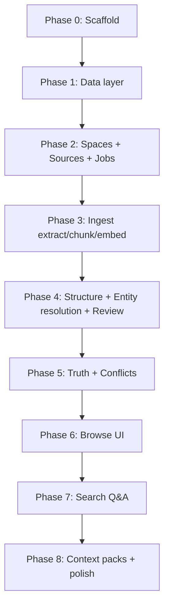

# Vortex — Build Readiness Synthesis

> **Status:** Working document — resolve open items here before writing code.  
> **Sources:** [Initial-idea.md](./Initial-idea.md) · [TECHNICAL.md](./TECHNICAL.md) · [openapi.yaml](./openapi.yaml)  
> **Created:** 2026-06-06

---

## Purpose

This file captures a pre-build review of the Vortex specs from an **LLM/agent execution** lens: what is solid, what will cause guessing or drift, and how to split work into actionable phases. Use it as a checklist to refine specs collaboratively before scaffolding.

---

## Overall assessment

### What works well

- Clear three-way split: product (`Initial-idea.md`) → implementation (`TECHNICAL.md`) → contracts (`openapi.yaml`)
- V1 product decisions are locked (no open scope questions in Initial-idea)
- Schema, ingest stages, entity-resolution tiers, and UI→route→API map (TECH §10) are unusually detailed
- Truth lifecycle, conflict rules, and Explore/Verified semantics are explicit

### What will cause an LLM (or human) to stall, drift, or over-build

- ~3,500 lines across docs with heavy repetition (search modes, link types, promote flow appear 3×)
- No phased **build order with acceptance criteria**
- Several **algorithm contracts** are named but not specified (chunking, hybrid ranking, structure-step JSON)
- A few **internal contradictions** and naming splits (`fast`/`expert` vs Explore/Verified, `meta.json` vs `manifest.json`)

### Verdict

Specs are **buildable in principle** but **not yet agent-ready**. Without refinement, an implementer will likely:

- Implement schema and CRUD confidently
- Guess on chunking, hybrid ranking, and structure-step JSON
- Build search before ingest/truth is solid (violating Initial-idea Next steps)
- Introduce inconsistencies around naming and unresolved-entity facts

---

## Refinement checklist

Track resolution in the **Resolution log** at the bottom. Mark items: `open` | `resolved` | `deferred`.

### P0 — Blockers before coding

| ID | Issue | Why it blocks | Suggested fix | Status |
|----|-------|---------------|---------------|--------|
| P0-1 | No `BUILD_PLAN.md` / phased milestones | Agent builds everything at once or wrong order | Add 6–8 phases with dependencies, “done when”, and which openapi routes each phase must pass | open |
| P0-2 | `extraction.json` schema incomplete | Structure step is core; only `mentions` + `decision_candidates` shown | Full JSON Schema: `candidate_facts`, `link_proposals`, `about_entities`, predicates, value types, confidence | open |
| P0-3 | Chunking strategy missing | No token size, overlap, page boundaries, max chunks/source | Add ingest §4.1: e.g. 512–800 tokens, 10% overlap, respect PDF `pages.json` | open |
| P0-4 | Hybrid search fusion underspecified | “Weighted rank” with no formula, weights, top-K | Add search §8.4: per-index weights, merge formula (RRF vs linear), default K, entity/fact boost | open |
| P0-5 | Hold strategy contradiction | §6.2 mentions “provisional stub”; §6.3 says no fact rows until resolved | Pick one rule; state once; cross-reference from both sections | open |
| P0-6 | `fact_key` generation ambiguous | “`{entity_id}:{predicate}` or finer key” — no deterministic rule | Rule: ingest sets `{entity_id}:{predicate}` unless user splits slot in conflict UI | open |
| P0-7 | `meta.json` vs `manifest.json` | TECH §1 uses `meta.json`; §3 uses `manifest.json` | Pick one filename; align all docs | open |

### P1 — High risk of wrong implementation

| ID | Issue | Suggested fix | Status |
|----|-------|---------------|--------|
| P1-8 | `fast`/`expert` vs Explore/Verified naming split | Top-of-file mapping table; consider openapi aliases or codegen comments | open |
| P1-9 | Entity types not closed | `EntityType` enum in openapi + Zod; full V1 list | open |
| P1-10 | Predicate / value typing | Predicate conventions + which value column per predicate family | open |
| P1-11 | Ingest LLM prompts absent | `prompts/structure.md` with system prompt, JSON schema, few-shot examples | open |
| P1-12 | Ingest failure / partial progress | Failed at stage X → status; retry = new job from stage 1 or resume from X | open |
| P1-13 | Embedding dimension coupling | SQL `FLOAT[1536]` vs Ollama models; tie to `config.json.embeddingModel` | open |
| P1-14 | Supported file types | MIME list, max bytes, multi-page image behavior | open |
| P1-15 | Review resolve action matrix | Table: which `action` per `ReviewItemKind` | open |

### P2 — Quality, testability, context efficiency

| ID | Issue | Suggested fix | Status |
|----|-------|---------------|--------|
| P2-16 | No golden E2E fixture | `fixtures/loan-sanction/` — sample source, expected entities/facts, conflict, promote, query | open |
| P2-17 | No acceptance criteria per feature | Per phase: API tests + UI smoke checks | open |
| P2-18 | Document duplication | Initial = UX; TECH = algorithms; openapi = HTTP shapes only | open |
| P2-19 | FTS5 / sqlite-vec triggers | Appendix or migrations README with trigger SQL | open |
| P2-20 | Fuzzy match implementation | Specify algorithm behind thresholds (FTS bm25, trigram, etc.) | open |
| P2-21 | Conflict edge cases | 3 worked examples with before/after DB state | open |
| P2-22 | Context pack `pack.md` format | Minimal Markdown template | open |
| P2-23 | Nav badge polling | Poll interval or SSE → revalidate strategy | open |
| P2-24 | Server Actions vs Route Handlers | Per-route decision in BUILD_PLAN | open |
| P2-25 | Missing agent constraints | `AGENT_CONSTRAINTS.md`: forbidden deps, must-use stack | open |

### P3 — Nice to have

| ID | Issue | Suggested fix | Status |
|----|-------|---------------|--------|
| P3-26 | TECHNICAL.md length (~1,735 lines) | Split into SCHEMA / INGEST / SEARCH; TECH as index | open |
| P3-27 | Mermaid ER diagram | Duplicate critical FK list as bullet table for LLM parsers | open |
| P3-28 | Space-level search mode persistence | Document: default `fast`, client localStorage only in V1 | open |
| P3-29 | Version pins | Phase 0 scaffold with locked `package.json` versions | open |

---

## Proposed build phases

Dependency graph:

### Phase summary

| Phase | Scope | Done when | Primary refs |
|-------|--------|-----------|--------------|
| **0 — Scaffold** | Next.js, Drizzle, sqlite-vec load, job poller shell, `pnpm` scripts | `GET /api/health` 200; DB migrates; extension loads | TECH §1–2, openapi health |
| **1 — Schema** | All 14 tables + FTS + vec migrations | Drizzle schema matches TECH §5; triggers work | TECH §5, openapi schemas |
| **2 — Spaces & upload** | CRUD spaces, multipart upload, disk layout, enqueue ingest job | Upload → 202 + job; file on disk; source row | TECH §3, openapi sources/jobs |
| **3 — Extract & chunk** | PDF parse, OCR, chunking, FTS + embed (no LLM structure yet) | Ingest completes through embed; chunks searchable | TECH §4 stages 1–3, 8 |
| **4 — Structure & review** | LLM structure, entity resolution tiers, review inbox API+UI | Proposed facts + review items; hold strategy consistent | TECH §4, §6, openapi review |
| **5 — Truth & conflicts** | Promote/dismiss/supersede, conflict detect+resolve | Golden fixture: conflict → promote → truth panel | TECH §7, openapi facts/conflicts |
| **6 — Browse shell** | App Router pages, nav badges, entity/source detail | All IA routes render with real data | Initial IA, TECH §10 |
| **7 — Search** | Hybrid retrieval + synthesis + citations | Explore + Verified modes pass fixture queries | TECH §8, openapi search |
| **8 — Exports** | Context packs canon/full + exports UI | `pack.json` matches §8.3 schema | TECH §8.3, openapi context-packs |

### Each phase packet should include

1. **In scope / out of scope** (prevent scope creep)
2. **Files to create** (from TECH layout)
3. **API routes to implement** (from openapi)
4. **Acceptance tests** (1–3 concrete scenarios)
5. **Dependencies** (previous phase only)

---

## Minimal refinement path (highest leverage)

If resolving only a few items before coding:

1. **`BUILD_PLAN.md`** — phases above + acceptance criteria
2. **`schemas/extraction.json`** — full structure-step contract
3. **`schemas/ingest-algorithms.md`** — chunking + hybrid fusion + fuzzy match (~1 page)
4. **Fix contradictions** — hold strategy (P0-5), manifest filename (P0-7)
5. **`fixtures/`** — golden path: upload → conflict → promote → query
6. **Trim duplication** — Initial owns UX; TECH owns algorithms; openapi owns HTTP only

---

## Resolution log

Record decisions made in chat here. Link to updated spec sections when resolved.

| Date | ID | Decision | Updated in |
|------|-----|----------|------------|
| — | — | — | — |

---

## Working agreement

- **No application code** until P0 items are resolved or explicitly deferred with rationale.
- **Product behavior changes** → update `Initial-idea.md` first, then TECH/openapi.
- **Algorithm/schema contracts** → prefer new focused docs (`schemas/`, `BUILD_PLAN.md`) over bloating TECH further.
- This file is the **single checklist** for pre-build readiness; close items in the Resolution log as we go.
