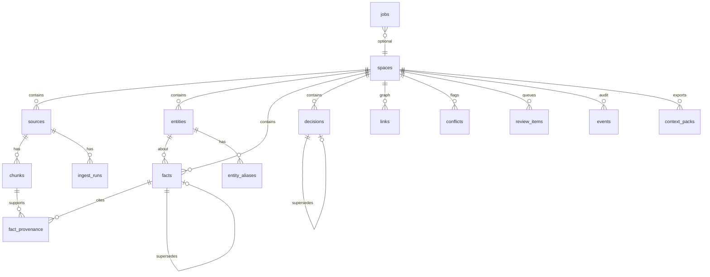

# Vortex — Technical Implementation

> **Product spec:** [Initial-idea.md](./Initial-idea.md) (V1 behavior — update there first)  
> **API spec:** [openapi.yaml](./openapi.yaml) (routes and request/response shapes)

This document describes **how to build** Vortex V1: stack, schema, pipelines, and API conventions. It does not redefine product scope — when in doubt, Initial-idea wins.

| Document | Owns |
| -------- | ---- |
| **Initial-idea.md** | User-facing behavior, V1 in/out, UX primitives, product decisions |
| **TECHNICAL.md** (this file) | Stack, storage layout, schema, ingest/search algorithms, implementation detail |
| **openapi.yaml** | HTTP routes, enums, JSON shapes |

---

## 1. System topology

### Decisions


| Decision              | Choice                                              |
| --------------------- | --------------------------------------------------- |
| Language              | **TypeScript / Node.js**                            |
| Process model         | **Monolith** — single deployable app                |
| Application framework | **Next.js** (App Router) — UI + API in one codebase |


### Runtime shape

```
┌──────────────────────────────────────────────────────────────┐
│  Browser                                                     │
└────────────────────────────┬─────────────────────────────────┘
                             │ HTTP (localhost:3000)
┌────────────────────────────▼─────────────────────────────────┐
│  Next.js monolith (Node.js)                                  │
│  ┌─────────────────────┐  ┌────────────────────────────────┐ │
│  │ App Router (UI)     │  │ Route Handlers / Server Actions│ │
│  │ pages & components  │  │ REST-ish API for V1 flows       │ │
│  └─────────────────────┘  └────────────────────────────────┘ │
│  ┌─────────────────────────────────────────────────────────┐ │
│  │ In-process job runner (SQLite-backed job table)         │ │
│  │ ingest: full refinery pipeline (see §4)                 │ │
│  └─────────────────────────────────────────────────────────┘ │
└──────────────┬───────────────────────────────┬─────────────────┘
               │                               │
    ┌──────────▼──────────┐         ┌──────────▼──────────┐
    │  SQLite             │         │  LLM client         │
    │  schema + FTS5      │         │  OpenAI / Ollama    │
    │  + sqlite-vec       │         │  (BYOK via env)     │
    └──────────┬──────────┘         └─────────────────────┘
               │
    ┌──────────▼──────────────────────────────────────────┐
    │  Disk: {data_dir}/spaces/{space_id}/assets/...      │
    └─────────────────────────────────────────────────────┘
```

### Rationale

- **One install, one process** — matches local-first, single-user V1; no Redis, no separate worker service.
- **Next.js** — UI and API colocated; Server Components for browse views; Route Handlers for uploads, search, and job triggers.
- **SQLite-backed jobs** — ingest can run for minutes (PDF, OCR, LLM). Jobs are rows with status; a lightweight poller in the same Node process picks up work. Survives restarts; no in-memory-only queue.
- **Graph in SQL** — `links` table + bounded traversal in application code (per product spec); no Neo4j in V1.

### Long-running work in Next.js

Ingest must not block HTTP requests. Pattern:

1. Upload Route Handler writes asset + enqueues job → returns `202` + job id.
2. Job runner starts with the Node process (or on first request via lazy init) and processes the queue sequentially or with small concurrency (e.g. 2).
3. UI polls job status or uses SSE for ingest progress.

Dev: `next dev` runs UI + API + job runner. Prod: `next start` — same monolith.

### Data directory (default)

```
~/.vortex/                    # or ./data in dev
  config.json                 # LLM provider, API keys path, data_dir override
  vortex.db                   # SQLite
  spaces/
    {space_id}/
      assets/
        {source_id}/          # immutable original + derived previews
          original.pdf
          meta.json
```

---

## 2. Stack selection

### Decisions


| Layer               | Choice                                                                        | Status    |
| ------------------- | ----------------------------------------------------------------------------- | --------- |
| Framework           | Next.js 15, App Router                                                        | ✅ decided |
| ORM / DB driver     | **Drizzle ORM** + `better-sqlite3`                                            | ✅ decided |
| Migrations          | Drizzle Kit                                                                   | ✅ decided |
| Full-text search    | SQLite **FTS5** on chunks, entities, and facts                                | ✅ decided |
| Job queue           | Custom `jobs` table + in-process poller                                       | ✅ decided |
| Validation          | Zod                                                                           | ✅ decided |
| LLM client          | Vercel AI SDK (`@ai-sdk/openai`, Ollama provider)                             | ✅ decided |
| UI                  | Tailwind + shadcn/ui                                                          | ✅ decided |
| PDF text extraction | `pdf-parse`                                                                   | ✅ decided |
| Vector search       | **sqlite-vec** (chunk embeddings, hybrid with FTS5)                           | ✅ decided |
| OCR (images)        | `**tesseract.js`** (local WASM, no cloud)                                     | ✅ decided |
| Package manager     | **pnpm**                                                                      | ✅ decided |
| Embeddings          | Same LLM provider as ingest (OpenAI embeddings API or Ollama embedding model) | ✅ decided |


### Why Drizzle

- Migrations are editable SQL — needed for FTS5, sqlite-vec, and custom indexes.
- `better-sqlite3` is a natural fit for a local single-process app.
- Graph hops, conflict queries, and provenance joins stay SQL-shaped without fighting an ORM abstraction.
- Lighter than Prisma (no query engine binary) for a monolith that also runs background ingest.

Prisma was considered for faster CRUD bootstrap; rejected because search, FTS, and custom truth/conflict queries are core to V1, not an edge case.

### Core dependencies

```
next, react, react-dom
drizzle-orm, better-sqlite3, drizzle-kit
sqlite-vec                              # loadable SQLite extension
zod
ai, @ai-sdk/openai, ollama-ai-provider
pdf-parse
tesseract.js
tailwindcss, @radix-ui/*                # via shadcn
```

### sqlite-vec setup

- Load extension once at DB init: `sqliteVec.load(db)` (via `better-sqlite3` `loadExtension`).
- Store embeddings in a vec table keyed by `chunk_id`.
- **One step inside ingest (§4):** after chunking, batch-embed chunk text → insert vectors.
- **Search:** hybrid retrieval — FTS5 keyword score + vector cosine similarity, merged with weighted rank (details in §8).
- **Re-embed:** if embedding model changes, enqueue a `reembed` job for the space (does not re-run full ingest).

### OCR (tesseract.js)

- Runs locally in Node via WASM — no native Tesseract install, no cloud OCR.
- Used for image sources (PNG, JPG, etc.) — **extract stage** of ingest (§4), not ingest itself.
- OCR output becomes chunks; downstream structure, facts, and embed steps follow.
- Slower than cloud OCR; acceptable for V1 local-first use. Show per-page progress in ingest UI.

### Scripts


| Script                      | Purpose                                      |
| --------------------------- | -------------------------------------------- |
| `pnpm dev`                  | Next.js dev + job runner init                |
| `pnpm build` / `pnpm start` | Production monolith                          |
| `pnpm db:generate`          | Drizzle Kit — generate migration from schema |
| `pnpm db:migrate`           | Apply migrations to `vortex.db`              |
| `pnpm db:studio`            | Drizzle Studio (debug)                       |


### Project layout (monorepo-style, single package)

```
vortex-app/
  src/
    app/                    # Next.js App Router (UI + route handlers)
    db/
      schema/               # Drizzle table definitions
      migrations/           # Generated SQL
      index.ts              # db client (better-sqlite3 singleton)
    lib/
      jobs/                 # Queue + runner
      ingest/               # Pipeline stages
      search/               # FTS + Q&A retrieval
      llm/                  # AI SDK wrappers
    components/
  data/                     # Dev data dir (gitignored)
  TECHNICAL.md
  Initial-idea.md
```

---

## 3. Directory & storage layout

### Principles

- **Sources are immutable** on disk — re-upload creates a new `source_id`.
- **Database is system of record** for entities, facts, decisions, links, and truth status.
- **Disk holds originals + derived caches** (summaries, extraction snapshots) — not canonical truth.
- Everything scoped under `space_id`.

### Layout

```
{data_dir}/                          # ~/.vortex (prod) or ./data (dev)
  config.json
  vortex.db                          # SQLite + FTS5 + sqlite-vec
  spaces/
    {space_id}/
      assets/
        {source_id}/
          original.{ext}             # immutable upload — never overwritten
          manifest.json              # sha256, mime, byte size, uploaded_at
          derived/
            preview.webp             # optional thumbnail (PDF page 1, image resize)
            extract/
              pages.json             # PDF: [{ page, char_offset, char_length }]
            ocr/                     # image sources only
              page-001.txt           # raw OCR text per page/region
            ingest/                  # structured output snapshot (derived, not SoT)
              v{run_version}/
                extraction.json      # full LLM structured output — audit / replay
                summary.md           # human-readable source summary
      exports/
        context-packs/
          {pack_id}/
            pack.json
            pack.md                  # optional human-readable export
```

### Rules


| Rule              | Detail                                                                   |
| ----------------- | ------------------------------------------------------------------------ |
| Disk vs DB naming | Disk folder **`assets/`** holds blobs; DB table **`sources`** holds metadata — no `assets` table (Initial-idea § Storage) |
| Immutability      | Re-upload = new `source_id`; old asset retained for provenance           |
| Paths in DB       | Relative from `{data_dir}` — portable if data dir moves                  |
| IDs               | UUIDs for `space_id`, `source_id` — no user filenames in paths           |
| Original filename | DB metadata only (`sources.original_filename`)                           |
| Ingest snapshots  | `derived/ingest/v{n}/` written per ingest run; DB rows are authoritative |
| Deletion          | Soft-delete source in DB; asset dir retained until explicit purge (V1)   |


### `config.json`

```json
{
  "dataDir": "./data",
  "llm": {
    "provider": "openai",
    "model": "gpt-4o",
    "embeddingModel": "text-embedding-3-small"
  },
  "ingest": { "maxConcurrentJobs": 2 }
}
```

Secrets (`OPENAI_API_KEY`, etc.) in **env vars**, not `config.json`.

---

## 4. Ingest pipeline

**Ingest is not vectorization.** Ingest is the full **refinery pipeline** that turns an uploaded source into structured knowledge in the database — plus derived caches on disk for display and audit.

Vector embedding is **one late step** inside ingest, alongside extraction, structuring, entity resolution, and conflict detection.

### What ingest produces


| Output                  | Where                                               | Notes                                                    |
| ----------------------- | --------------------------------------------------- | -------------------------------------------------------- |
| **Chunks**              | DB (`chunks`) + FTS5 + sqlite-vec                   | Citable text spans with page/offset                      |
| **Entities**            | DB (`entities`)                                     | Created or matched; aliases updated                      |
| **Facts**               | DB (`facts`, status `proposed`)                     | Candidate claims — **not** auto-promoted to `true` in V1 |
| **Links**               | DB (`links`)                                        | `mentions`, `about`, `supports`, `related`, etc.         |
| **Conflicts**           | DB (`conflicts` or flagged facts)                   | vs existing true facts / active decisions                |
| **Source summary**      | Disk (`derived/ingest/.../summary.md`) + DB pointer | Derived cache for browse UI                              |
| **Extraction snapshot** | Disk (`derived/ingest/.../extraction.json`)         | Full structured LLM output for replay                    |
| **Entity summaries**    | DB (`entities.summary`, derived)                    | Regenerated after ingest touches entity                  |
| **Review items**        | DB (`review_queue`)                                 | Low-confidence entity matches, ambiguous mentions        |
| **Embeddings**          | sqlite-vec                                          | Search index only                                        |


**Decisions** enter the system via **manual create** or **ingest → review → confirm**. Ingest never writes `active` decisions directly — it enqueues `decision_suggestion` review items.

**Truth** (`true` facts, active decisions) is curated **after** ingest via promote / supersede / resolve — not written automatically by the pipeline (unless a future auto-promote rule is added).

### Pipeline stages (one job per source)

```
upload
  │
  ▼
1. store asset          → original on disk, source row in DB
  │
  ▼
2. extract              → PDF text / OCR → raw text + page map
  │
  ▼
3. chunk                → chunks table + FTS5 index
  │
  ▼
4. structure (LLM)      → entities, candidate facts, link proposals,
  │                       decision candidates; write extraction.json + summary.md
  ▼
5. entity resolution    → match existing / create new / queue review
  │
  ▼
6. persist graph        → entities, facts (proposed), links, provenance;
  │                       decision_suggestion review items (not active decisions)
  │
  ▼
7. conflict detection   → compare vs true facts & active decisions
  │
  ▼
8. embed                → sqlite-vec for each chunk
  │
  ▼
9. refresh derived      → entity summaries, source status = complete
```

Each stage updates `ingest_runs` progress (stage, percent, error) for the Inbox UI.

### Re-ingest

New upload or explicit re-run → new `ingest_run` version → **new chunk rows** (old chunks retained for provenance) → new proposed facts → new conflict flags. Prior ingest snapshot kept under `derived/ingest/v{n}/`. Truth layer unchanged until user acts.

Source browse defaults to **latest ingest run** chunks (`sources.latest_ingest_run_id`); historical runs available for audit.

### Job types (related but distinct)


| Job                      | Purpose                                 |
| ------------------------ | --------------------------------------- |
| `ingest_source`          | Full pipeline above                     |
| `reembed_space`          | Re-vectorize chunks only (model change) |
| `refresh_entity_summary` | Regenerate one entity's derived summary |


---

## 5. Database schema

All tables include `space_id` where the row is space-scoped (denormalized for query speed). IDs are UUID text unless noted.

### Design principles

- **Polymorphic links** — one `links` table; `from_kind` / `to_kind` + IDs (no Neo4j).
- **Structured facts** — typed value columns + `fact_key` for conflict grouping (not prose-only).
- **Supersession on row** — `supersedes_id` on facts and decisions; mirrored by optional `supersedes` links.
- **Provenance twice** — `fact_provenance` for query speed; `supports` links for graph traversal.
- **Audit via events** — promotions, merges, and truth changes append to `events` (timeline UI).
- **Derived ≠ SoT** — summaries and paths live on rows but are regeneratable.

### Entity-relationship overview




---

### Enums

```typescript
// Fact lifecycle (Initial-idea)
// V1 uses: proposed → true → superseded only. `corroborated` reserved for post-V1.
type FactStatus = 'proposed' | 'corroborated' | 'true' | 'superseded';

// Decision lifecycle
type DecisionStatus = 'active' | 'superseded';

// Link kinds (V1-minimal set)
type LinkType =
  | 'mentions'      // chunk | source → entity
  | 'about'         // source → entity
  | 'supports'      // chunk → fact
  | 'related'       // entity → entity
  | 'applies_to'    // decision → entity
  | 'establishes'   // decision → fact
  | 'overrides'     // decision → fact
  | 'canon_for'     // decision | entity → fact (canon row for a fact_key slot)
  | 'supersedes';   // fact → fact (optional mirror of column)

type NodeKind = 'source' | 'chunk' | 'entity' | 'fact' | 'decision';

type SourceIngestStatus = 'pending' | 'processing' | 'complete' | 'failed';

type IngestStage =
  | 'store' | 'extract' | 'chunk' | 'structure'
  | 'resolve' | 'persist' | 'conflicts' | 'embed' | 'refresh';

type JobStatus = 'pending' | 'running' | 'complete' | 'failed';
type JobType = 'ingest_source' | 'reembed_space' | 'refresh_entity_summary';

type ConflictStatus = 'open' | 'resolved';  // V1: no dismiss-without-resolution

type ReviewItemKind =
  | 'entity_match'          // ambiguous mention → candidate entities
  | 'entity_create'         // new entity low confidence
  | 'entity_merge_suggestion' // duplicate entities detected post-match
  | 'decision_suggestion';  // text looks like owner commitment

type ReviewItemStatus = 'pending' | 'accepted' | 'dismissed';
```

---

### Core tables

#### `spaces`


| Column        | Type      | Notes        |
| ------------- | --------- | ------------ |
| `id`          | TEXT PK   | UUID         |
| `name`        | TEXT      | Display name |
| `description` | TEXT NULL | Optional     |
| `created_at`  | INTEGER   | Unix ms      |
| `updated_at`  | INTEGER   | Unix ms      |


---

#### `sources`


| Column                 | Type                       | Notes                                |
| ---------------------- | -------------------------- | ------------------------------------ |
| `id`                   | TEXT PK                    | UUID                                 |
| `space_id`             | TEXT FK → spaces           |                                      |
| `original_filename`    | TEXT                       | User-facing name                     |
| `mime_type`            | TEXT                       | e.g. `application/pdf`               |
| `byte_size`            | INTEGER                    |                                      |
| `sha256`               | TEXT                       | Integrity check                      |
| `asset_path`           | TEXT                       | Relative path to `original.{ext}`    |
| `ingest_status`        | TEXT                       | `SourceIngestStatus`                 |
| `latest_ingest_run_id` | TEXT NULL FK → ingest_runs |                                      |
| `summary_path`         | TEXT NULL                  | Relative path to latest `summary.md` |
| `deleted_at`           | INTEGER NULL               | Soft delete                          |
| `created_at`           | INTEGER                    |                                      |


**Indexes:** `(space_id, created_at DESC)`, `(space_id, ingest_status)`

---

#### `ingest_runs`

One row per pipeline execution on a source.


| Column            | Type              | Notes                                 |
| ----------------- | ----------------- | ------------------------------------- |
| `id`              | TEXT PK           |                                       |
| `space_id`        | TEXT FK           |                                       |
| `source_id`       | TEXT FK → sources |                                       |
| `version`         | INTEGER           | 1, 2, 3… per source                   |
| `stage`           | TEXT              | `IngestStage`                         |
| `status`          | TEXT              | `JobStatus`-like                      |
| `progress_pct`    | INTEGER           | 0–100 for UI                          |
| `error_message`   | TEXT NULL         |                                       |
| `extraction_path` | TEXT NULL         | `derived/ingest/v{n}/extraction.json` |
| `summary_path`    | TEXT NULL         |                                       |
| `llm_model`       | TEXT NULL         | Model used for structure step         |
| `started_at`      | INTEGER NULL      |                                       |
| `finished_at`     | INTEGER NULL      |                                       |
| `created_at`      | INTEGER           |                                       |


**Indexes:** `(source_id, version DESC)`

---

#### `chunks`


| Column          | Type                  | Notes                                                                    |
| --------------- | --------------------- | ------------------------------------------------------------------------ |
| `id`            | TEXT PK               | Citation target                                                          |
| `space_id`      | TEXT FK               |                                                                          |
| `source_id`     | TEXT FK → sources     |                                                                          |
| `ingest_run_id` | TEXT FK → ingest_runs | Which run created this chunk — **immutable**; re-ingest creates new rows |
| `ordinal`       | INTEGER               | Order within source                                                      |
| `page`          | INTEGER NULL          | PDF/page number                                                          |
| `char_start`    | INTEGER NULL          | Offset in extracted full text                                            |
| `char_end`      | INTEGER NULL          |                                                                          |
| `content`       | TEXT                  | Chunk text                                                               |
| `token_count`   | INTEGER NULL          | For budget caps                                                          |
| `created_at`    | INTEGER               |                                                                          |


**Indexes:** `(source_id, ingest_run_id, ordinal)`, `(space_id, source_id)`

**FTS5:** virtual table `chunks_fts(chunk_id UNINDEXED, content)` synced on insert/update/delete.

**Vectors:** sqlite-vec table `chunk_vectors(chunk_id PRIMARY KEY, embedding)` — dimension fixed per embedding model config.

---

#### `entities`


| Column               | Type                    | Notes                                                                         |
| -------------------- | ----------------------- | ----------------------------------------------------------------------------- |
| `id`                 | TEXT PK                 | Stable target for all links                                                   |
| `space_id`           | TEXT FK                 |                                                                               |
| `canonical_name`     | TEXT                    | Display + match primary                                                       |
| `entity_type`        | TEXT                    | e.g. `person`, `organization`, `account`, `regulation` — global generic types |
| `summary`            | TEXT NULL               | **Derived** LLM summary; regenerated on ingest                                |
| `summary_updated_at` | INTEGER NULL            |                                                                               |
| `merged_into_id`     | TEXT NULL FK → entities | Set when merged; redirects                                                    |
| `created_at`         | INTEGER                 |                                                                               |
| `updated_at`         | INTEGER                 |                                                                               |


**Indexes:** `(space_id, canonical_name)`, `(space_id, entity_type)`

**FTS5:** virtual table `entities_fts` — indexes `canonical_name`, `entity_type`, and alias text from `entity_aliases`. Synced via triggers on entity/alias changes.

#### `entity_aliases`


| Column       | Type               | Notes                   |
| ------------ | ------------------ | ----------------------- |
| `id`         | TEXT PK            |                         |
| `space_id`   | TEXT FK            |                         |
| `entity_id`  | TEXT FK → entities |                         |
| `alias`      | TEXT               | Normalized for matching |
| `source`     | TEXT               | `ingest` | `user`       |
| `created_at` | INTEGER            |                         |


**Unique:** `(space_id, alias)` where entity not merged

---

#### `facts`

Atomic, checkable claims. **Conflict detection** groups by `(entity_id, predicate, fact_key)`.


| Column             | Type                 | Notes                                                            |
| ------------------ | -------------------- | ---------------------------------------------------------------- |
| `id`               | TEXT PK              |                                                                  |
| `space_id`         | TEXT FK              |                                                                  |
| `entity_id`        | TEXT FK → entities   | Subject                                                          |
| `predicate`        | TEXT                 | e.g. `rera_id`, `interest_rate`, `balance`                       |
| `fact_key`         | TEXT                 | Stable slot: `{entity_id}:{predicate}` or finer key              |
| `status`           | TEXT                 | `FactStatus` — V1: only `proposed`, `true`, `superseded` written |
| `value_text`       | TEXT NULL            |                                                                  |
| `value_number`     | REAL NULL            | Money, rates                                                     |
| `value_date`       | TEXT NULL            | ISO date                                                         |
| `value_json`       | TEXT NULL            | Structured overflow                                              |
| `display_text`     | TEXT                 | Human sentence for UI                                            |
| `confidence`       | REAL NULL            | 0–1 from ingest                                                  |
| `supersedes_id`    | TEXT NULL FK → facts | Previous fact in chain                                           |
| `superseded_by_id` | TEXT NULL FK → facts |                                                                  |
| `promoted_at`      | INTEGER NULL         | When status → `true`                                             |
| `dismissed_at`     | INTEGER NULL         | User dismissed proposed fact                                     |
| `dismissed_reason` | TEXT NULL            | Optional note                                                    |
| `created_at`       | INTEGER              |                                                                  |
| `updated_at`       | INTEGER              |                                                                  |


**Indexes:**

- `(space_id, entity_id, status)`
- `(space_id, fact_key, status)` — conflict queries
- `(space_id, status)` — inbox / browse filters

**FTS5:** virtual table `facts_fts` — indexes `display_text` and `predicate`. Synced on fact insert/update/delete. Filter by `status` in query (prioritize `true` facts in search ranking).

---

#### `fact_provenance`

Chunk-level evidence for a fact (fast provenance queries).


| Column          | Type                  | Notes         |
| --------------- | --------------------- | ------------- |
| `id`            | TEXT PK               |               |
| `space_id`      | TEXT FK               |               |
| `fact_id`       | TEXT FK → facts       |               |
| `chunk_id`      | TEXT FK → chunks      |               |
| `source_id`     | TEXT FK → sources     | Denormalized  |
| `ingest_run_id` | TEXT FK → ingest_runs |               |
| `quote`         | TEXT NULL             | Short excerpt |
| `confidence`    | REAL NULL             |               |
| `created_at`    | INTEGER               |               |


**Indexes:** `(fact_id)`, `(chunk_id)`

---

#### `decisions`

Owner commitments — not auto-activated by ingest.


| Column             | Type                       | Notes                                 |
| ------------------ | -------------------------- | ------------------------------------- |
| `id`               | TEXT PK                    |                                       |
| `space_id`         | TEXT FK                    |                                       |
| `title`            | TEXT                       | Short label                           |
| `body`             | TEXT                       | Full statement                        |
| `status`           | TEXT                       | `DecisionStatus`                      |
| `effective_date`   | TEXT NULL                  | ISO date                              |
| `supersedes_id`    | TEXT NULL FK → decisions   |                                       |
| `superseded_by_id` | TEXT NULL FK → decisions   |                                       |
| `source_id`        | TEXT NULL FK → sources     | Optional evidence                     |
| `chunk_id`         | TEXT NULL FK → chunks      | Optional citation                     |
| `origin`           | TEXT                       | `user` | `ingest_confirmed`           |
| `ingest_run_id`    | TEXT NULL FK → ingest_runs | Set when confirmed from ingest review |
| `review_item_id`   | TEXT NULL                  | Source review item when applicable    |
| `created_at`       | INTEGER                    |                                       |
| `updated_at`       | INTEGER                    |                                       |


**Indexes:** `(space_id, status)`, `(space_id, created_at DESC)`

---

#### `links`

Typed graph edges. Application validates `from_kind`/`to_kind` pairs per `link_type`.


| Column          | Type         | Notes                        |
| --------------- | ------------ | ---------------------------- |
| `id`            | TEXT PK      |                              |
| `space_id`      | TEXT FK      |                              |
| `link_type`     | TEXT         | `LinkType`                   |
| `from_kind`     | TEXT         | `NodeKind`                   |
| `from_id`       | TEXT         |                              |
| `to_kind`       | TEXT         | `NodeKind`                   |
| `to_id`         | TEXT         |                              |
| `weight`        | REAL NULL    | For ranking (default 1.0)    |
| `source`        | TEXT         | `ingest` | `user` | `system` |
| `ingest_run_id` | TEXT NULL FK |                              |
| `metadata_json` | TEXT NULL    |                              |
| `created_at`    | INTEGER      |                              |


**Indexes:**

- `(space_id, from_kind, from_id)`
- `(space_id, to_kind, to_id)`
- `(space_id, link_type)`
- `(space_id, from_id, link_type)` — expansion queries

**Valid pairs (V1):**


| link_type     | from → to                |
| ------------- | ------------------------ |
| `mentions`    | chunk | source → entity  |
| `about`       | source → entity          |
| `supports`    | chunk → fact             |
| `related`     | entity → entity          |
| `applies_to`  | decision → entity        |
| `establishes` | decision → fact          |
| `overrides`   | decision → fact          |
| `canon_for`   | decision | entity → fact |
| `supersedes`  | fact → fact              |


---

### Operations tables

#### `conflicts`

Surfaced during ingest step 7 or on manual fact create.


| Column              | Type               | Notes                              |
| ------------------- | ------------------ | ---------------------------------- |
| `id`                | TEXT PK            |                                    |
| `space_id`          | TEXT FK            |                                    |
| `fact_key`          | TEXT               | Grouping key                       |
| `entity_id`         | TEXT FK → entities |                                    |
| `status`            | TEXT               | `ConflictStatus`                   |
| `summary`           | TEXT               | Human-readable description         |
| `fact_ids_json`     | TEXT               | JSON array of conflicting fact IDs |
| `decision_ids_json` | TEXT NULL          | If decision contradicts            |
| `ingest_run_id`     | TEXT NULL FK       | Triggering run                     |
| `resolved_at`       | INTEGER NULL       |                                    |
| `resolution_note`   | TEXT NULL          |                                    |
| `created_at`        | INTEGER            |                                    |


**Indexes:** `(space_id, status)`, `(space_id, entity_id)`

---

#### `review_items`

Inbox for low-confidence ingest output.


| Column            | Type         | Notes                                    |
| ----------------- | ------------ | ---------------------------------------- |
| `id`              | TEXT PK      |                                          |
| `space_id`        | TEXT FK      |                                          |
| `kind`            | TEXT         | `ReviewItemKind`                         |
| `status`          | TEXT         | `ReviewItemStatus`                       |
| `source_id`       | TEXT NULL FK |                                          |
| `ingest_run_id`   | TEXT NULL FK |                                          |
| `payload_json`    | TEXT         | Candidates, mention span, suggested text |
| `resolution_json` | TEXT NULL    | What user chose                          |
| `created_at`      | INTEGER      |                                          |
| `resolved_at`     | INTEGER NULL |                                          |


**Indexes:** `(space_id, status)`, `(space_id, kind, status)`

---

#### `events`

Append-only audit log — powers timeline and context-pack `as_of` reconstruction.


| Column         | Type      | Notes                      |
| -------------- | --------- | -------------------------- |
| `id`           | TEXT PK   |                            |
| `space_id`     | TEXT FK   |                            |
| `event_type`   | TEXT      | See below                  |
| `object_kind`  | TEXT      | `NodeKind` or `ingest_run` |
| `object_id`    | TEXT      |                            |
| `payload_json` | TEXT NULL | Before/after, related IDs  |
| `created_at`   | INTEGER   |                            |


`**event_type` examples:** `source_uploaded`, `ingest_completed`, `fact_proposed`, `fact_promoted`, `fact_superseded`, `fact_dismissed`, `fact_undismissed`, `decision_created`, `decision_superseded`, `entity_merged`, `conflict_opened`, `conflict_resolved`, `link_created`

**Index:** `(space_id, created_at DESC)`

---

#### `jobs`

SQLite-backed queue for the in-process runner.


| Column          | Type         | Notes                      |
| --------------- | ------------ | -------------------------- |
| `id`            | TEXT PK      |                            |
| `space_id`      | TEXT NULL FK |                            |
| `job_type`      | TEXT         | `JobType`                  |
| `payload_json`  | TEXT         | e.g. `{ "sourceId": "…" }` |
| `status`        | TEXT         | `JobStatus`                |
| `attempts`      | INTEGER      | Default 0                  |
| `max_attempts`  | INTEGER      | Default 3                  |
| `error_message` | TEXT NULL    |                            |
| `run_after`     | INTEGER      | Scheduled unix ms          |
| `started_at`    | INTEGER NULL |                            |
| `finished_at`   | INTEGER NULL |                            |
| `created_at`    | INTEGER      |                            |


**Index:** `(status, run_after)` — poller query

---

#### `context_packs`

Versioned exports for agents.


| Column          | Type      | Notes                                                    |
| --------------- | --------- | -------------------------------------------------------- |
| `id`            | TEXT PK   |                                                          |
| `space_id`      | TEXT FK   |                                                          |
| `version`       | INTEGER   | Monotonic per space                                      |
| `as_of`         | INTEGER   | Unix ms — truth snapshot time                            |
| `label`         | TEXT NULL | User label                                               |
| `pack_type`     | TEXT      | `canon` | `full`                                         |
| `manifest_json` | TEXT      | Entity IDs, true fact IDs, decision IDs, source pointers |
| `export_path`   | TEXT      | Relative path to `pack.json`                             |
| `created_at`    | INTEGER   |                                                          |


**Index:** `(space_id, version DESC)`

---

### Search objects (not Drizzle-managed)

Created via raw SQL migrations:

```sql
-- Chunk full-text
CREATE VIRTUAL TABLE chunks_fts USING fts5(
  content,
  content='chunks',
  content_rowid='rowid'
);

-- Entity name / type / alias search ("BSP account", "RERA")
CREATE VIRTUAL TABLE entities_fts USING fts5(
  canonical_name,
  entity_type,
  aliases_text,
  content='entities',
  content_rowid='rowid'
);
-- `aliases_text` = concatenated aliases; maintained by triggers on entity_aliases

-- Fact claim search
CREATE VIRTUAL TABLE facts_fts USING fts5(
  display_text,
  predicate,
  content='facts',
  content_rowid='rowid'
);

-- Chunk vectors
CREATE VIRTUAL TABLE chunk_vectors USING vec0(
  chunk_id TEXT PRIMARY KEY,
  embedding FLOAT[1536]
);
```

**Hybrid search (V1):** run queries in parallel across `entities_fts`, `facts_fts`, `chunks_fts`, and `chunk_vectors` → merge scores (entity/fact hits boosted for navigational queries) → expand 1–2 hops on high-trust links → synthesize with citations.

---

### Key queries (V1)


| UI surface         | Query pattern                                                                                             |
| ------------------ | --------------------------------------------------------------------------------------------------------- |
| Entity truth panel | `facts WHERE entity_id = ? AND status = 'true'` + `decisions` via `applies_to` links, `status = 'active'` |
| Conflicts inbox    | `conflicts WHERE status = 'open'`                                                                         |
| Source page        | `chunks` + `links` where `from_id = source` and `link_type IN ('mentions','about')`                       |
| Link expansion     | 1–2 hop BFS on `links` filtered by allowlist types; cap by token budget                                   |
| Hybrid search      | `entities_fts` ∪ `facts_fts` ∪ `chunks_fts` ∪ vec KNN on `chunk_vectors` → merge scores → expand graph    |


---

### Schema stats (V1)


| Table                         | ~Purpose                          |
| ----------------------------- | --------------------------------- |
| `spaces`                      | Workspace root                    |
| `sources`                     | Immutable evidence metadata       |
| `ingest_runs`                 | Pipeline progress + derived paths |
| `chunks`                      | Citable text                      |
| `entities` + `entity_aliases` | Things in the world               |
| `facts` + `fact_provenance`   | Claims + evidence                 |
| `decisions`                   | Owner commitments                 |
| `links`                       | Graph                             |
| `conflicts`                   | Truth collisions                  |
| `review_items`                | Human-in-the-loop queue           |
| `events`                      | Timeline / audit                  |
| `jobs`                        | Background work                   |
| `context_packs`               | Agent exports                     |


**14 tables** + **4 virtual** (3× FTS5: chunks, entities, facts; 1× sqlite-vec).

### Schema decisions (V1)


| #   | Question                  | Decision                                                                                                                                                                      |
| --- | ------------------------- | ----------------------------------------------------------------------------------------------------------------------------------------------------------------------------- |
| 1   | `**corroborated` status** | ✅ Keep in schema; **unused in V1**. UI and ingest only transition `proposed` → `true` (user promote) → `superseded`. Reserved for post-V1 corroboration / auto-promote rules. |
| 2   | **Re-ingest chunks**      | ✅ **New chunk rows per ingest run.** Old chunks kept for provenance and citations. Source UI defaults to `latest_ingest_run_id`.                                              |
| 3   | **Entity/fact FTS**       | ✅ **In V1.** `entities_fts` (name, type, aliases) + `facts_fts` (display_text, predicate) alongside chunk FTS + vectors.                                                      |


---

## 6. Entity resolution

Entity resolution runs at **ingest stage 5 (`resolve`)**. Every extracted mention must end up pointing at a stable `entity_id` before links and facts are persisted — or land in the **review queue** for human decision.

Wrong merges poison browse and Q&A; V1 is **conservative on auto-match** and **strong on manual review**.

---

### 6.1 Goal & normalization

#### Input / output

**Input** (from `extraction.json`):

```json
{
  "mentions": [
    {
      "text": "BSP Home Loan",
      "suggested_type": "account",
      "chunk_id": "…",
      "confidence": 0.82
    }
  ]
}
```

**Output (per mention):**


| Result                     | Action                                                          |
| -------------------------- | --------------------------------------------------------------- |
| High-confidence match      | Link to existing `entity_id`; add alias if new surface form     |
| No match, high confidence  | Create new entity                                               |
| Ambiguous / low confidence | Create `review_item` — **no graph links until resolved**        |
| User resolves review       | Apply choice; write links, aliases, `events`; remove from queue |


#### Normalization — **Option A (light)** ✅

Applied to every incoming mention and every stored alias before comparison. Display text (`canonical_name`) is **not** normalized.


| Step                         | Example                                       |
| ---------------------------- | --------------------------------------------- |
| Unicode NFKC                 | `ＢＳＰ` → `BSP`                                 |
| Trim + collapse whitespace   | `" BSP Home Loan "` → `"BSP Home Loan"`       |
| Lowercase (Latin)            | → `"bsp home loan"`                           |
| Strip decorative punctuation | `"BSP (Home Loan)"` → `"bsp home loan"`       |
| **Preserve** meaningful IDs  | `"RERA P52100001234"` → `"rera p52100001234"` |


**Not done in V1 (too aggressive):** acronym folding (`"B.S.P."` → `"bsp"`), legal suffix stripping (`"Ltd."`), phonetic/fuzzy collapse. Those cases go to **review** instead of silent merge.

---

### 6.2 Manual review system

Review is a **first-class refinery surface**, not an error log. The UI must make unresolved ambiguity visible and **resurface** it until the user acts.

#### Principles

1. **Never silently merge on ambiguity** — multiple candidates or low confidence → review queue.
2. **Block downstream links until resolved** — unresolved mentions do not get `mentions` / `about` links or fact attachment (facts referencing unresolved entities wait or attach to a provisional stub — see 6.3).
3. **Resurface automatically** — new evidence can reopen or create review items; nothing stays hidden because it was "seen once."
4. **Audit everything** — accept/dismiss/merge writes to `events`.

#### Review item kinds (V1)


| Kind                      | Trigger                                                        | User choices                                             |
| ------------------------- | -------------------------------------------------------------- | -------------------------------------------------------- |
| `entity_match`            | 2+ alias/FTS candidates above fuzzy threshold                  | Pick one entity, or "create new"                         |
| `entity_create`           | No match; LLM confidence below auto-create threshold           | Confirm create, pick different name, or link to existing |
| `entity_merge_suggestion` | Post-ingest duplicate detection (same type + high fuzzy score) | Merge A→B, dismiss, defer                                |
| `decision_suggestion`     | Structure step finds commitment-like text                      | Confirm → create `active` decision; edit; dismiss        |


#### Resurfacing rules


| Event                                                                                       | Behavior                                                                                     |
| ------------------------------------------------------------------------------------------- | -------------------------------------------------------------------------------------------- |
| New ingest mentions same normalized form as **open** review item                            | Bump `updated_at`; show "new evidence" badge; attach new `chunk_id` / `source_id` to payload |
| New ingest **contradicts** prior resolution (matched different entity with high confidence) | Create **new** `entity_match` review item; flag both sources                                 |
| User **dismissed** item                                                                     | Stays dismissed unless new ingest re-triggers with **different** candidate set → new item    |
| User **merged** entities                                                                    | Re-scan open review items referencing merged IDs; auto-resolve or re-queue                   |
| Space has any `pending` review items                                                        | **Review inbox** badge on nav; optional prompt after ingest completes                        |


#### UI surfaces

1. **Review inbox** (`/spaces/{id}/review`) — filter by kind, sort by newest evidence.
2. **Post-ingest banner** — "3 items need review" with link.
3. **Entity / source context** — inline chip on unresolved mentions: "Needs review".
4. **Bulk merge tool** (V1 simple) — side-by-side entity compare from `entity_merge_suggestion` items.

#### Payload shape (`review_items.payload_json`)

```json
{
  "mention_text": "B.S.P. Housing",
  "normalized": "b.s.p. housing",
  "suggested_type": "organization",
  "chunk_id": "…",
  "source_id": "…",
  "llm_confidence": 0.71,
  "candidates": [
    { "entity_id": "…", "canonical_name": "BSP", "match_score": 0.88, "match_kind": "fuzzy" },
    { "entity_id": "…", "canonical_name": "BSP Home Loan", "match_score": 0.76, "match_kind": "fuzzy" }
  ],
  "evidence_chunk_ids": ["…"]
}
```

`evidence_chunk_ids` accumulates across resurfacing events.

---

### 6.3 Matching tiers

After normalization, each mention is evaluated top-to-bottom. **First decisive tier wins.**


| Tier                                   | Condition                                                | Action                                                  |
| -------------------------------------- | -------------------------------------------------------- | ------------------------------------------------------- |
| **T1 — Exact alias**                   | Normalized form = `entity_aliases.alias` in space        | Auto-link; add surface form as alias if new             |
| **T2 — Exact canonical**               | Normalized form = `entities.canonical_name` (normalized) | Auto-link                                               |
| **T3 — FTS single hit**                | One result in `entities_fts`, score ≥ **0.92**           | Auto-link                                               |
| **T4 — Fuzzy multi**                   | 2+ candidates with score ≥ **0.75**                      | → `entity_match` review (**hold** — no links/facts yet) |
| **T5 — Fuzzy single**                  | One candidate ≥ **0.85**                                 | Auto-link                                               |
| **T6 — No match, high LLM confidence** | No candidate ≥ 0.75; LLM ≥ **0.85**                      | Auto-create entity                                      |
| **T7 — No match, low confidence**      | LLM < 0.85                                               | → `entity_create` review (**hold**)                     |


#### Hold strategy (unresolved mentions) ✅

Mentions in T4 or T7 do **not** get `mentions` / `about` links or fact rows in the DB until the user resolves the review item. Structured output stays in `extraction.json`; ingest completes with review items flagged. Source page shows "N mentions pending review."

#### Post auto-create duplicate scan (T6) ✅

After every **T6 auto-create**, run fuzzy match against other entities of the same `entity_type` in the space. If any candidate scores ≥ **0.75**, enqueue `entity_merge_suggestion` (non-blocking; ingest still completes). User merges, keeps separate, or dismisses — never auto-merge.

---

### 6.4 Merge flow

Triggered from `entity_merge_suggestion` review items or manual merge on entity page. User picks **survivor B** and **merged A** (A → B).

#### Steps (single transaction)


| Step | Action                                                                              |
| ---- | ----------------------------------------------------------------------------------- |
| 1    | Set `A.merged_into_id = B.id`                                                       |
| 2    | Move all `entity_aliases` from A → B; dedupe on normalized `alias`                  |
| 3    | Repoint `facts.entity_id` from A → B                                                |
| 4    | Repoint all `links` where `from_id` or `to_id` = A → B (same `from_kind`/`to_kind`) |
| 5    | Repoint `fact_provenance`, `conflicts.entity_id` where applicable                   |
| 6    | Rebuild `entities_fts` for B; remove A from default FTS row (A hidden)              |
| 7    | Resolve or re-queue open `review_items` referencing A                               |
| 8    | If merged facts share same `fact_key` with incompatible values → open `conflict`    |
| 9    | Append `entity_merged` event `{ from: A, to: B, actor: user }`                      |


#### Canonical name

Keep **B**'s `canonical_name` unless user explicitly chooses A's name in merge dialog.

#### Merged entity visibility ✅

**Soft redirect + hidden from default browse:**

- A remains in DB; `merged_into_id` set.
- Direct URL `/entities/A` shows banner: "Merged into [B]" with link.
- All internal queries resolve `merged_into_id` chain to canonical entity (A → B → …).
- Entity list/search excludes rows where `merged_into_id IS NOT NULL`.
- Aliases on A still resolve via redirect to B.

---

## 7. Truth & conflicts

Truth is **user-curated** after ingest. Ingest creates `proposed` facts; the user promotes, supersedes, dismisses, and resolves conflicts.

---

### 7.1 Promote & supersede

#### One true fact per slot

For each `fact_key` in a space, **at most one** fact has `status = 'true'` at a time. Truth panel, Q&A, and context packs read only `true` facts (+ active decisions).

```
proposed  ──(user promote)──►  true  ──(supersede)──►  superseded
```

`corroborated` unused in V1 (see §5 schema decisions).

#### `fact_key`

Stable slot: `{entity_id}:{predicate}` (e.g. interest rate, RERA id). Set at ingest. Same key + incompatible value → conflict (§7.2). Same key + compatible value → additional proposed fact with provenance only.

#### Promote (`proposed` → `true`) ✅ auto-supersede

User action from entity page, fact row, or conflict resolution.


| Step | Action                                                         |
| ---- | -------------------------------------------------------------- |
| 1    | Validate fact is `proposed`, not dismissed, entity resolved    |
| 2    | Find existing `true` fact with same `fact_key`                 |
| 3    | If exists → **auto-supersede** old in same transaction (below) |
| 4    | Set fact `status = 'true'`, `promoted_at = now`                |
| 5    | Append `fact_promoted` event                                   |
| 6    | Close related open `conflict` if resolved                      |


#### Supersede (`true` → `superseded`)


| Step | Action                                                         |
| ---- | -------------------------------------------------------------- |
| 1    | Old fact: `status = 'superseded'`, `superseded_by_id = new.id` |
| 2    | New fact: `supersedes_id = old.id`                             |
| 3    | Optional `supersedes` link (fact → fact)                       |
| 4    | Append `fact_superseded` event with `{ old_id, new_id }`       |


Superseded facts stay on entity timeline and source provenance; excluded from truth panel and agent canon.

#### Dismissed proposals ✅

User can **dismiss** a `proposed` fact without promoting — wrong extraction, irrelevant, duplicate noise.


| Field                    | Purpose                        |
| ------------------------ | ------------------------------ |
| `facts.dismissed_at`     | INTEGER NULL — set on dismiss  |
| `facts.dismissed_reason` | TEXT NULL — optional user note |


- Row **kept** in DB for audit and source provenance.
- Hidden from default entity fact lists and promote actions.
- Toggle: "Show dismissed" on entity page.
- Append `fact_dismissed` event.
- Dismissed facts **cannot** be promoted without **undismiss** first.

No `rejected` status in V1 — dismiss flag only.

#### UI actions (V1)


| Action          | When                                                                               |
| --------------- | ---------------------------------------------------------------------------------- |
| Promote to true | `proposed`, not dismissed                                                          |
| Supersede       | Promote different proposed fact for same `fact_key` (auto-supersedes current true) |
| Dismiss         | `proposed` only                                                                    |
| Undismiss       | `proposed` + `dismissed_at` set                                                    |
| View history    | Timeline shows promote / supersede / dismiss events                                |


---

### 7.2 Conflict detection

Conflicts surface when the knowledge base has **incompatible claims for the same slot** or when **decisions contradict true facts**. Nothing is silently merged.

#### Triggers


| Trigger            | Example                                                                 |
| ------------------ | ----------------------------------------------------------------------- |
| Ingest step 7      | New `proposed` fact `interest_rate = 8.5%` vs existing `true` at `9.1%` |
| Manual fact create | User adds fact that clashes with `true`                                 |
| Entity merge       | Merged entities had different values for same `fact_key`                |
| Decision vs fact   | Active decision `overrides` / `establishes` contradicts a `true` fact   |


Promote with auto-supersede **closes** fact-vs-fact conflicts when user picks the new truth; it does not bypass decision-vs-fact conflicts (§7.3).

#### Compatible vs incompatible ✅ strict equality

Same `fact_key` and values compared **strictly** by typed column:


| Column         | Rule                                                          |
| -------------- | ------------------------------------------------------------- |
| `value_number` | Exact REAL equality — no epsilon / tolerance in V1            |
| `value_text`   | Normalized string equality (light normalize: trim, lowercase) |
| `value_date`   | Same ISO date string                                          |
| Mixed types    | Always incompatible                                           |


Same `fact_key` + identical values → no conflict; attach provenance only.

#### Decision vs fact ✅ must resolve (B)

When an **active decision** links via `overrides` or `establishes` to a fact that **contradicts** a `true` fact (same `fact_key` or explicit canon scope):

- Open `conflict` with `decision_ids_json` populated.
- **Neither side is "clean"** until user resolves — no silent "decision wins" in Q&A or context packs.
- Q&A may cite both with explicit conflict flag in Evidence panel.

Resolution options (§7.3): supersede fact, supersede decision, or split/re-key facts.

#### Conflict row

Uses `conflicts` table: `fact_key`, `entity_id`, `fact_ids_json`, optional `decision_ids_json`, `status: open | resolved`, `ingest_run_id` when from ingest.

Ingest creates conflicts as **open**; does not auto-resolve.

---

### 7.3 Conflict resolution

Conflicts inbox (`/spaces/{id}/conflicts`) lists `status = open` only. **Resolution required** — no "dismiss conflict" without picking an outcome.

#### Fact vs fact


| Resolution       | Actions                                                                                                                                        |
| ---------------- | ---------------------------------------------------------------------------------------------------------------------------------------------- |
| **Pick as true** | Promote chosen fact (auto-supersedes current `true` if same `fact_key`); mark conflict `resolved`; optional dismiss of losing *proposed* facts |
| **Split slots**  | User edits `fact_key` / predicate on one fact so they no longer collide → re-run conflict check → resolve if clear                             |


#### Decision vs fact


| Resolution            | Actions                                                                                                               |
| --------------------- | --------------------------------------------------------------------------------------------------------------------- |
| **Decision is canon** | Supersede conflicting `true` fact (or chain supersede); decision stays `active`; conflict `resolved`                  |
| **Fact is canon**     | Supersede decision (`status = superseded`); remove `overrides` / `establishes` links if orphaned; conflict `resolved` |
| **Revise decision**   | Edit decision → re-evaluate → resolve when aligned                                                                    |


#### On resolve (all paths)


| Step | Action                                                                               |
| ---- | ------------------------------------------------------------------------------------ |
| 1    | Apply chosen fact/decision state changes in one transaction                          |
| 2    | Set `conflict.status = resolved`, `resolved_at`, `resolution_note`                   |
| 3    | Append `conflict_resolved` event with `{ conflict_id, resolution_kind, winner_ids }` |


#### Audit trail on conflict detail ✅

Resolved conflicts remain browsable (`/conflicts/{id}`):

- Read-only view of both sides at time of conflict
- Superseded facts/decisions still linked — visible as history, not in truth panel
- Resolution note + timeline events shown

Open conflicts block neither promote nor decision create, but **Q&A and context packs flag unresolved conflicts** in the space and exclude "clean canon" export until resolved.

---

### 7.4 Decisions & truth

Decisions are **normative** — what the owner commits to, not merely what a document says.

#### Sources of decisions (V1)


| Path                | Flow                                                                                                                                                                                  |
| ------------------- | ------------------------------------------------------------------------------------------------------------------------------------------------------------------------------------- |
| **Manual**          | User creates decision → `origin = user`, `status = active`                                                                                                                            |
| **Ingest → review** | LLM structure step emits `decision_candidates` → `decision_suggestion` review item → user **Confirm** creates `active` decision with `origin = ingest_confirmed`, citations prefilled |


Ingest **never** inserts `active` decisions. Unconfirmed suggestions stay in review or are dismissed.

#### Structure step output (decision candidates)

```json
{
  "decision_candidates": [
    {
      "title": "30-year loan term",
      "body": "We take the 30-year BSP home loan option.",
      "chunk_id": "…",
      "entity_mentions": ["BSP Home Loan"],
      "confidence": 0.79
    }
  ]
}
```

Resolve entity mentions through entity resolution (§6) before review item is created — hold if entity unresolved.

#### Review → confirm


| User action        | Result                                                                                                                                        |
| ------------------ | --------------------------------------------------------------------------------------------------------------------------------------------- |
| **Confirm**        | Create `decisions` row (`active`); `applies_to` links for resolved entities; optional `source_id` / `chunk_id`; run conflict detection (§7.2) |
| **Edit & confirm** | Same with user-edited title/body/scope                                                                                                        |
| **Dismiss**        | Review item closed; no decision row                                                                                                           |


Append `decision_created` event with `{ origin, review_item_id, ingest_run_id }`.

#### Scope & links


| Link          | Purpose                                                       |
| ------------- | ------------------------------------------------------------- |
| `applies_to`  | Entity scope — **zero or more** (zero = space-level decision) |
| `establishes` | Decision sets operational canon for a fact                    |
| `overrides`   | Decision replaces true fact for canon                         |
| `canon_for`   | Pointer to the canon **fact** for a slot (`fact_key`)        |


#### Multiple active decisions ✅

**No `decision_key` in V1** — multiple `active` decisions per entity allowed (different topics). Supersede is explicit user action when one decision replaces another on the same topic.

#### Superseding decisions

User selects "Supersede" on an active decision → new or existing decision becomes active; old → `superseded` with `supersedes_id` chain + `decision_superseded` event.

#### Decision + fact canon

When user confirms a decision that establishes/overrides fact values:

1. Create decision + links
2. Create or promote facts as needed + `establishes` / `overrides` links
3. Run conflict detection — open conflict if incompatible with existing `true` facts (§7.2 B)

#### Truth panel composition

Per entity: `**true` facts** + `**active` decisions** where `applies_to` includes entity (or space-level decisions shown on space home).

---

## 8. Search & Q&A

Single natural-language search box (Initial-idea). Two modes: **Explore** (broad — includes proposed extractions) and **Verified** (promoted truth only).

Mode selector in search UI — default **Explore**; persisted per space in client localStorage. API enum values remain `fast` and `expert` (see §8.1).

---

### 8.1 Search modes: Explore vs Verified

UI labels: **Explore** / **Verified**. API request field `mode`: `fast` (= Explore) | `expert` (= Verified).


|                          | **Explore** (`fast`)                                                       | **Verified** (`expert`)                                                                                      |
| ------------------------ | -------------------------------------------------------------------------- | ------------------------------------------------------------------------------------------------------------ |
| **Goal**                 | Search everything relevant — exploratory                                   | Agent-grade — promoted facts and active decisions only                                                       |
| **Facts in context**     | `proposed`, `true` (not dismissed, not superseded)                         | `**true` only**                                                                                              |
| **Decisions in context** | `active` + `**decision_suggestion` pending review** flagged as unconfirmed | `**active` only**                                                                                            |
| **Chunk retrieval**      | Full hybrid: `entities_fts`, `facts_fts`, `chunks_fts`, `chunk_vectors`    | Chunks must **support** a `true` fact or cite an `**active` decision**, or `about` an entity with true facts |
| **Link expansion**       | 1 hop; all link types except `supersedes`                                  | 1–2 hops; allowlist: `supports`, `about`, `applies_to`, `establishes`, `overrides`, `canon_for`              |
| **Open conflicts**       | Mention in Evidence if hit                                                 | **Banner** + chunk fallback disclaimer if no verified truth                                                  |
| **Proposed in answer**   | Allowed with **"unverified"** badge                                        | **Never** — omit from synthesis context                                                                      |
| **LLM context budget**   | Smaller (e.g. 8k tokens)                                                   | Larger (e.g. 16k tokens)                                                                                     |
| **Latency target**       | Lower — fewer filters, smaller prompt                                      | Higher — stricter filtering acceptable                                                                       |


#### Verified mode retrieval (strict)

```
1. Parse query → hybrid search on entities_fts + facts_fts (status = true) + chunk_vectors
2. Filter facts: status = 'true' AND dismissed_at IS NULL
3. Filter decisions: status = 'active'
4. Include chunk iff:
     - fact_provenance links chunk → true fact, OR
     - chunk supports true fact (link), OR
     - chunk cited by active decision, OR
     - source about entity that has true facts (secondary)
5. Graph expand 1–2 hops on high-trust links only
6. Exclude entire space canon if export-style "clean" needed — else include conflict warning
```

#### Explore mode retrieval (light)

```
1. Full hybrid search across entities, facts (proposed + true), chunks (vectors + FTS)
2. Exclude: superseded facts, dismissed facts/proposals, merged entities
3. Graph expand 1 hop — include proposed facts and mentions links
4. Rank boost for true/active but do not exclude proposed
5. Smaller merged context → faster LLM call
```

#### Shared rules (both modes)

- **Mandatory citations** — every claim links to `chunk_id` and/or `fact_id` / `decision_id`
- **No silent blending** — superseded and dismissed never appear
- **Evidence panel** — collapsible; lists sources, chunks, facts/decisions used
- Explore mode labels proposed citations: `"Unverified (proposed)"`
- Verified mode labels: `"Verified (true)"` / `"Active decision"` (API citation label enum remains `canon` for true facts)

#### API / request shape

```json
{
  "query": "What is the BSP home loan rate?",
  "mode": "fast | expert",
  "space_id": "…"
}
```

`mode`: `fast` = Explore; `expert` = Verified.

Route: `POST /api/spaces/{id}/search`

---

### 8.2 Answer synthesis & citations

```
retrieve (mode-filtered) → build context → LLM synthesize → parse citations → validate → render
```

#### Zero verified-truth fallback ✅


| Mode         | No true facts / active decisions match                                                                                                                                                                          |
| ------------ | --------------------------------------------------------------------------------------------------------------------------------------------------------------------------------------------------------------- |
| **Verified** | **Fall back to retrieved chunks only** with prominent disclaimer: *"No promoted truth on this topic — answer from source excerpts only."* Citations are chunk-only; no `fact_id` / `decision_id` unless present |
| **Explore**  | Same chunk-forward behavior; softer disclaimer                                                                                                                                                                  |


Verified mode does **not** refuse outright — chunks with citations are still valuable — but never labels chunk-only claims as verified truth.

#### Citation contract

Structured response from LLM (parsed server-side):

```json
{
  "answer": "The BSP home loan rate is 8.5% as of the sanction letter.[1]",
  "citations": [
    {
      "ref": 1,
      "fact_id": "…",
      "chunk_id": "…",
      "source_id": "…",
      "label": "canon",
      "excerpt": "…"
    }
  ],
  "disclaimer": null
}
```


| Field     | Purpose                                              |
| --------- | ---------------------------------------------------- |
| `ref`     | Footnote number — matches `[1]` in answer text       |
| `label`   | `canon` | `decision` | `unverified` | `excerpt_only` |
| `excerpt` | Short quote for Evidence panel preview               |


#### Validation


| Mode       | Rule                                                                                                                     |
| ---------- | ------------------------------------------------------------------------------------------------------------------------ |
| Verified   | Claims tied to `true` fact / `active` decision when those IDs are in context; chunk-only claims use `excerpt_only` label |
| Explore    | Proposed facts allowed with `unverified` label                                                                           |
| Both       | Strip or re-prompt once if claim has no citation; prefer strip in Verified                                              |


#### Citation UI ✅ footnotes

- **Inline `[1]`, `[2]`** in answer text — clickable scroll to Evidence footnotes
- **Evidence panel** below answer — numbered list matching footnotes: source name, page, chunk excerpt, fact/decision badge
- Verified mode chunk-only fallback: footnotes show source preview only; banner at top for disclaimer

#### LLM prompt sketch

System: cite every claim; use `[n]` markers; never invent fact IDs; respect mode (Verified = promoted truth first, chunks when none).

Context blocks: `## True facts`, `## Active decisions`, `## Chunks` (mode-filtered per §8.1).

---

### 8.3 Context packs (export)

Versioned snapshots for external agents. Two export types — user picks at export time.

#### Pack types ✅


| Type      | `pack_type` | Contents                                                                                                                | Use when                                                          |
| --------- | ----------- | ----------------------------------------------------------------------------------------------------------------------- | ----------------------------------------------------------------- |
| **Canon** | `canon`     | `true` facts + `active` decisions + entity index + source pointers                                                      | Agent must treat as highest current truth (matches Verified search mode) |
| **Full**  | `full`      | Everything in Canon + `**proposed_appendix`** (non-dismissed `proposed` facts, pending `decision_suggestion` summaries) | Agent needs exploratory context; must not treat appendix as canon |


Both types include `conflicts_open` count and `as_of` timestamp. **Appendix items are explicitly labeled `trust: unverified`.**

#### Canon pack schema (`pack.json`)

```json
{
  "vortex_context_pack": "1.0",
  "pack_type": "canon",
  "space_id": "…",
  "version": 3,
  "as_of": "2026-06-06T12:00:00Z",
  "conflicts_open": 0,
  "entities": [
    { "id": "…", "canonical_name": "BSP Home Loan", "entity_type": "account" }
  ],
  "true_facts": [
    {
      "id": "…",
      "entity_id": "…",
      "fact_key": "…",
      "display_text": "Interest rate is 8.5%",
      "provenance": [{ "chunk_id": "…", "source_id": "…" }]
    }
  ],
  "active_decisions": [
    {
      "id": "…",
      "title": "30-year loan term",
      "body": "…",
      "applies_to": ["entity_id"],
      "provenance": [{ "chunk_id": "…", "source_id": "…" }]
    }
  ],
  "source_index": [
    { "source_id": "…", "original_filename": "sanction.pdf", "sha256": "…" }
  ]
}
```

#### Full pack — additional `proposed_appendix`

```json
{
  "pack_type": "full",
  "proposed_appendix": {
    "proposed_facts": [
      {
        "id": "…",
        "entity_id": "…",
        "display_text": "…",
        "trust": "unverified",
        "provenance": [{ "chunk_id": "…" }]
      }
    ],
    "pending_decisions": [
      {
        "review_item_id": "…",
        "title": "…",
        "body": "…",
        "trust": "unverified",
        "chunk_id": "…"
      }
    ]
  }
}
```

`pending_decisions` are **not** `active` — sourced from open `decision_suggestion` review items only.

#### Export flow


| Step | Action                                                                      |
| ---- | --------------------------------------------------------------------------- |
| 1    | User: Export → choose **Canon** or **Full** → optional label                |
| 2    | Snapshot DB at `as_of = now`; increment `context_packs.version` per space   |
| 3    | Write `exports/context-packs/{pack_id}/pack.json` + optional `pack.md`      |
| 4    | Insert `context_packs` row with `pack_type`, `manifest_json`, `export_path` |
| 5    | Append `context_pack_exported` event                                        |


Route: `POST /api/spaces/{id}/context-packs` body `{ "pack_type": "canon" | "full", "include_md": true }`

#### Open conflicts

Export **allowed** for both types. UI shows warning if `conflicts_open > 0`:

> "This space has N unresolved conflicts. Canon may be inconsistent."

Canon pack sets `"conflicts_open": N` in JSON so agents can refuse or ask for resolution.

#### Markdown export (`pack.md`)

Human-readable summary: truth strip per entity, decisions, footnote-style provenance. Full pack adds appendix section clearly headed **"Unverified — do not treat as canon"**.

---

## 9. API surface

**Canonical spec:** `[openapi.yaml](./openapi.yaml)` (OpenAPI 3.1)

The YAML file is the source of truth for routes, request/response shapes, and enums. Use it to browse, diff, and generate types (`openapi-typescript`, Redoc, Swagger UI). This section summarizes conventions only — details live in the spec.

### Conventions


| Topic       | Choice                                                                                                                                                    |
| ----------- | --------------------------------------------------------------------------------------------------------------------------------------------------------- |
| Style       | REST-ish Route Handlers under `/api/…`                                                                                                                    |
| Scope       | Almost all routes are space-scoped: `/api/spaces/{space_id}/…`                                                                                            |
| JSON fields | `snake_case` (aligns with SQLite columns)                                                                                                                 |
| Timestamps  | Unix ms in API responses; ISO 8601 in on-disk `pack.json`                                                                                                 |
| Auth        | None in V1 (`security: []` in spec) — local-first, single-user                                                                                            |
| Async work  | Upload, re-ingest, re-embed, entity summary refresh → `**202 Accepted`** + `job_id`; poll `GET /api/jobs/{job_id}` or SSE `GET /api/jobs/{job_id}/stream` |
| Pagination  | `limit` (default 50, max 200) + `offset` on list endpoints                                                                                                |
| Errors      | `{ "error": { "code", "message", "details?" } }` — `400`, `404`, `409`                                                                                    |


### Route map (summary)


| Area          | Methods                                                                                     | Notes                                                               |
| ------------- | ------------------------------------------------------------------------------------------- | ------------------------------------------------------------------- |
| Health        | `GET /api/health`                                                                           | Process + DB check                                                  |
| Spaces        | `GET`, `POST /api/spaces`; `GET`, `PATCH …/{space_id}`                                      | Workspace root                                                      |
| Sources       | `GET`, `POST …/sources`; `GET`, `DELETE …/sources/{source_id}`                              | Upload is `multipart/form-data`                                     |
| Chunks        | `GET …/chunks/{chunk_id}`                                                                   | Citation target                                                     |
| Ingest        | `POST …/sources/{source_id}/reingest`; `GET …/ingest-runs`                                  | New run version; old chunks retained                                |
| Jobs          | `GET /api/jobs/{job_id}`; `GET …/stream`; `POST …/jobs/reembed`                             | In-process SQLite queue                                             |
| Entities      | `GET`, `POST …/entities`; `GET`, `PATCH …/{entity_id}`; `POST …/merge`, `…/refresh-summary` | Merge is survivor path `{entity_id}`                                |
| Facts         | `GET`, `POST …/facts`; `GET …/{fact_id}`; `POST …/promote`, `…/dismiss`, `…/undismiss`      | Promote auto-supersedes same `fact_key`                             |
| Decisions     | `GET`, `POST …/decisions`; `GET`, `PATCH …/{decision_id}`; `POST …/supersede`               | Ingest never creates active decisions directly                      |
| Links         | `GET`, `POST …/links`                                                                       | Manual graph edges; validated `from_kind`/`to_kind` pairs           |
| Review        | `GET …/review`; `GET …/review/{review_item_id}`; `POST …/resolve`                           | Entity match/create/merge + decision suggestions                    |
| Conflicts     | `GET …/conflicts`; `GET …/{conflict_id}`; `POST …/resolve`                                  | No dismiss-without-outcome in V1                                    |
| Events        | `GET …/events`                                                                              | Append-only audit timeline                                          |
| Search        | `POST …/search`                                                                             | Body: `{ "query", "mode": "fast" \| "expert" }` → answer + citations (`fast` = Explore, `expert` = Verified) |
| Context packs | `GET`, `POST …/context-packs`; `GET …/{pack_id}`; `GET …/download`                          | `pack_type`: `canon` | `full`; optional `pack.md`                   |


### Server Actions vs Route Handlers


| Use Route Handlers               | Server Actions OK                  |
| -------------------------------- | ---------------------------------- |
| Upload (`multipart`)             | Promote / dismiss fact             |
| Search (streaming LLM)           | Simple form mutations in browse UI |
| Job polling / SSE                | —                                  |
| Context pack export (file write) | —                                  |


Prefer Route Handlers for anything that returns `202`, streams, or writes files; keep Server Actions for lightweight in-page mutations if it reduces boilerplate.

### Viewing the spec

```bash
npx @redocly/cli preview-docs openapi.yaml
```

Generate TypeScript types when implementing:

```bash
npx openapi-typescript openapi.yaml -o src/lib/api/types.ts
```

---

## 10. Product ↔ UI map

Maps [Initial-idea UX IA](./Initial-idea.md#ux-information-architecture-v1) to App Router pages and APIs. Pixel design is out of scope; this section fixes **where each product surface lives in code**.

### App Router (suggested)

```
src/app/
  page.tsx                              # redirect → /spaces
  spaces/
    page.tsx                            # list / create spaces
    [space_id]/
      page.tsx                          # Search (default space home)
      sources/
        page.tsx                        # Sources list + upload
        [source_id]/page.tsx            # Source detail
      entities/
        page.tsx                        # Entities index
        [entity_id]/page.tsx            # Entity detail (truth panel)
      facts/page.tsx                    # Facts index
      decisions/page.tsx                # Decisions index
      review/
        page.tsx                        # Review inbox
        [review_item_id]/page.tsx       # Review detail (optional; can be drawer)
      conflicts/
        page.tsx                        # Conflicts inbox
        [conflict_id]/page.tsx          # Conflict detail
      timeline/page.tsx                 # Events stream
      exports/page.tsx                  # Context packs list + export wizard
```

Search stays on `[space_id]/page.tsx` so `/spaces/{id}` is the default landing per Initial IA.

### Primitive → route → API

| UX primitive (Initial) | Page route | Primary API |
| ---------------------- | ---------- | ----------- |
| **Search** (Explore/Verified) | `/spaces/{id}` | `POST …/search` |
| **Ingest status** | `/spaces/{id}/sources`, `…/sources/{source_id}` | `POST …/sources` (upload → `202`), `GET …/sources`, `GET …/ingest-runs`, `GET /api/jobs/{job_id}`, `GET …/jobs/{job_id}/stream` |
| **Review inbox** | `/spaces/{id}/review` | `GET …/review`, `POST …/review/{id}/resolve` |
| **Conflicts** | `/spaces/{id}/conflicts`, `…/conflicts/{id}` | `GET …/conflicts`, `POST …/conflicts/{id}/resolve` |
| **Truth panel** | `/spaces/{id}/entities/{entity_id}` (section) | `GET …/entities/{id}`, `GET …/facts?entity_id=`, `GET …/decisions`, `GET …/links` |
| **Timeline** | `/spaces/{id}/timeline` (+ slice on entity detail) | `GET …/events?entity_id=` (optional filter) |
| **Context pack** | `/spaces/{id}/exports` | `GET/POST …/context-packs`, `GET …/context-packs/{id}/download` |
| **Browse indexes** | sources / entities / facts / decisions pages | `GET …/sources`, `…/entities`, `…/facts`, `…/decisions` |

### Truth curation actions (mostly on entity / fact / conflict pages)

| Action | Typical surface | API |
| ------ | --------------- | --- |
| Promote / dismiss / undismiss fact | Entity detail, Facts index, Conflict detail | `POST …/facts/{id}/promote`, `…/dismiss`, `…/undismiss` |
| Create decision | Decisions index, Review (confirm suggestion) | `POST …/decisions`, review resolve |
| Supersede decision | Decision detail | `POST …/decisions/{id}/supersede` |
| Merge entities | Review inbox, Entity detail | `POST …/entities/{id}/merge` |
| Manual link | Entity or Source detail | `POST …/links` |
| Re-ingest | Source detail | `POST …/sources/{id}/reingest` → `202` |

Prefer **Server Actions** for simple mutations on browse pages; **Route Handlers** for upload, search, jobs, exports (see §9).

### Nav badges

| Badge | Query |
| ----- | ----- |
| Sources processing | `sources WHERE ingest_status IN ('pending','processing')` count |
| Review pending | `review_items WHERE status = 'pending'` count |
| Conflicts open | `conflicts WHERE status = 'open'` count |

Poll or revalidate after ingest completes and after review/conflict resolve.

### Cross-references

| Topic | Initial | TECH |
| ----- | ------- | ---- |
| UX primitives | [§ UX primitives](./Initial-idea.md#ux-primitives-refinery-feel) | §10 (this section) |
| Review behavior | [§ V1 scope](./Initial-idea.md#v1-scope) | §6.2 |
| Search modes | [§ Search & Q&A](./Initial-idea.md#search--qa) | §8 |
| Context packs | [§ V1 scope](./Initial-idea.md#v1-scope) | §8.3 |
| HTTP details | — | [openapi.yaml](./openapi.yaml) |

